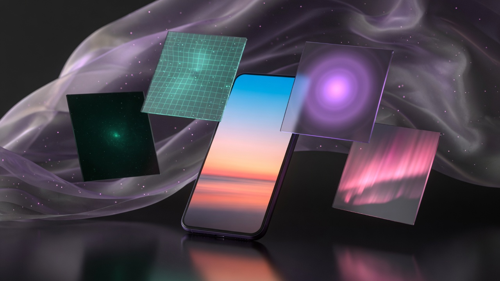
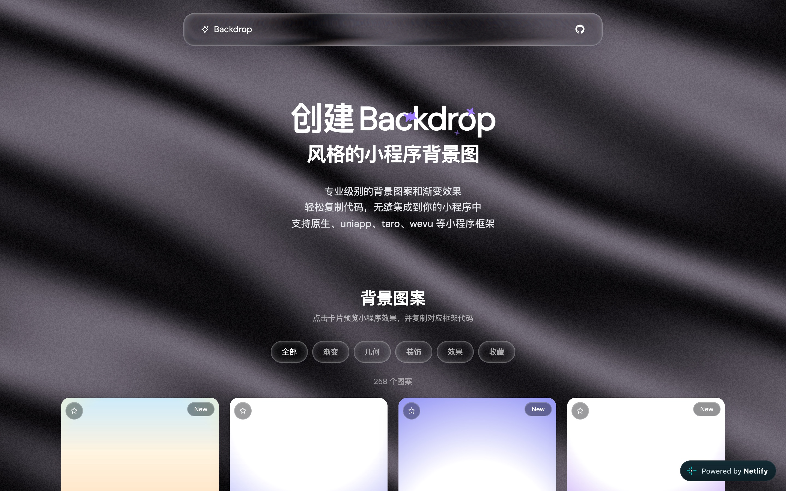
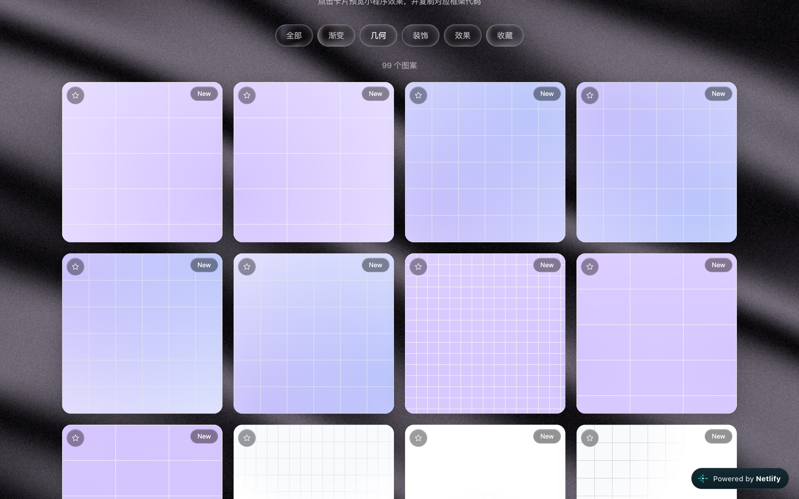
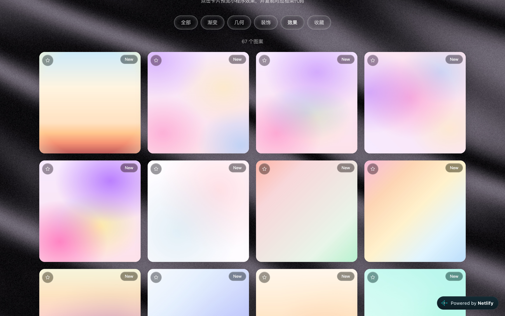
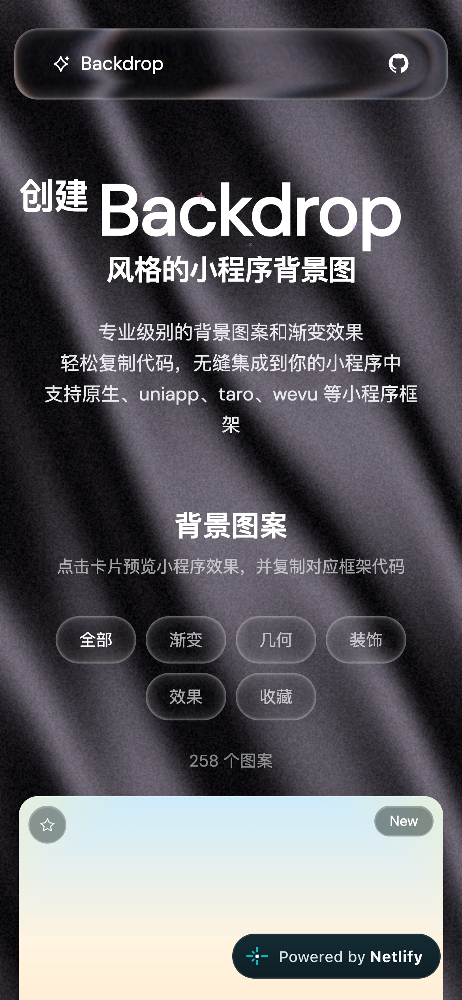
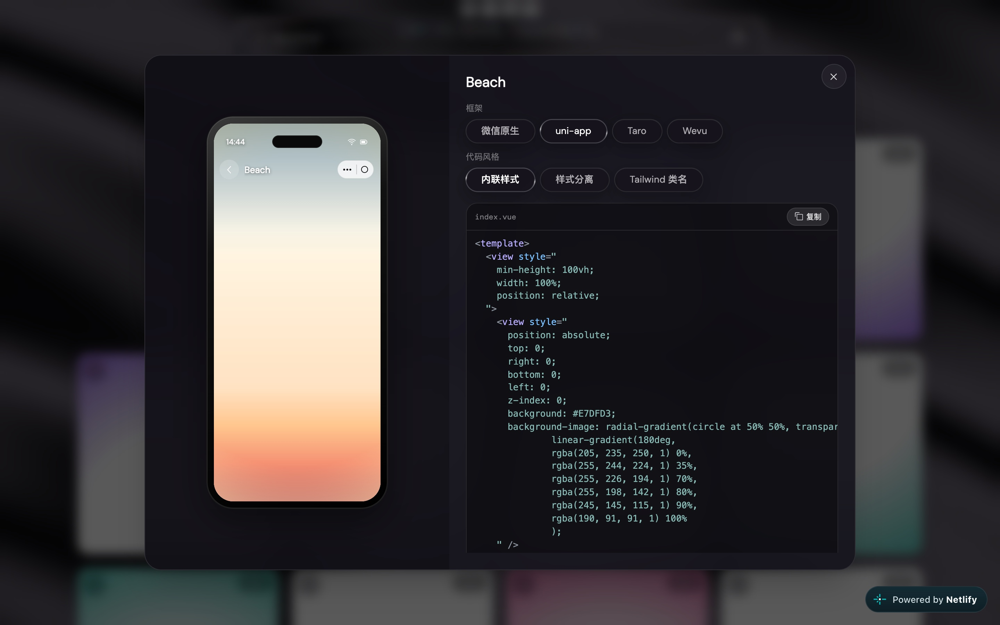

<!--
【发布前可删】

标题备选：
1. 别再让小程序裸奔了（推荐）
2. 打开这个网站，你的小程序突然有品位了
3. 小程序背景图，我再也不手搓了

封面：images/00-cover.jpg（公众号可裁成 2.35:1；掘金用 16:9）
摘要：打开十个小程序，九个背景是白的。Backdrop 收了 258 个现成背景，真机预览，复制就能用。

掘金标签：小程序、前端、开源、UI
网站：https://mpbackdrop.netlify.app/
GitHub：https://github.com/FliPPeDround/backdrop

公众号发图时，把文中相对路径换成上传后的图片。
-->

# 别再让小程序裸奔了

打开十个小程序，大概有九个在裸奔。

功能没毛病，背景太敷衍：要么一片白，要么就是那条从蓝到紫的经典渐变。你一看就知道，这页是凌晨两点赶出来的。

设计师说「再高级一点」。于是你把两个颜色来回拖，拖到怀疑人生。

写背景这件事，不该每次都从零开始。所以我做了 Backdrop。

> 在线逛背景，真机里预览，复制代码，粘进项目。免费，开源，不用登录。

链接放在最前面，省得你看到一半还要往回翻：

- 网站（建议收藏）：[https://mpbackdrop.netlify.app/](https://mpbackdrop.netlify.app/)
- GitHub（顺手点个 Star）：[https://github.com/FliPPeDround/backdrop](https://github.com/FliPPeDround/backdrop)

## 在小程序里放背景，有时候比写功能还烦

做过小程序的人大概都踩过这些坑：本地图片当背景，要转成一长串看不懂的编码；网络图片要去后台配域名；随手找的 JPG 一压缩，边缘糊成毛边。

Backdrop 不靠图片。它把渐变、光晕、网格、装饰纹理收成现成样式，一段代码铺满屏幕。没有图片请求，也不用担心这张图到底能不能商用。

库里目前有 258 个图案，按「渐变 / 几何 / 装饰 / 效果」分好类，还在慢慢加。

## 打开网站，像逛一家背景商店

网站本身的完成度就挺高。深色丝绸底，标题带一点闪光，往下翻是一整面背景卡片。

_图：Backdrop 首页，丝绸底 + 258 个可点的背景卡片。_

卡片左上角有颗星星，看对眼了就收藏，下次不用重新翻。收藏数据存在你自己的浏览器里，不会跑到别人的服务器上。

网格、点阵、细线，适合做工具类、数据类页面：

_图：几何分类，格子和细线派。_

粉紫光晕、海滩日落、雾一样的渐变，适合做活动页、登录页、个人中心：

_图：效果分类，适合想「看起来贵一点」的页面。_

手机上看也一样顺手，通勤时刷两眼，把候选背景先圈出来：

_图：手机里打开 Backdrop。_

## 点进去，像把背景套进真机

卡片点一下，会「长」成一台手机。左边是小程序里真实的铺满效果，右边是对应代码。标题、返回、电池，该有的壳都在，你不用脑补放到真机上会不会奇怪。

_图：左边看效果，右边复制代码。这个叫 Beach，日落味道很足。_

框架可以切：微信原生、uni-app、Taro、Wevu。代码风格也能切：内联样式、样式分离、Tailwind 类名。

选好之后点「复制」，回项目里粘一下。整套动作，大概比你在群里问一句「有没有现成背景」还快。

## 怎么用

打开 [Backdrop](https://mpbackdrop.netlify.app/)，按分类逛一圈，点进喜欢的卡片，看看它套在手机里好不好看，然后选你正在用的框架，复制，粘贴。就这些。

背景这个需求是反复出现的：登录页、活动页、空白状态、个人中心、活动规则。每一次都重新调色，既慢，又容易调回那条蓝紫渐变。所以收藏一次挺值，下次直接打开，先看一眼有没有现成的。

收藏方式随便挑：

- 浏览器里按 `Ctrl/Command + D`，收进书签栏
- 发到微信「文件传输助手」，下次搜「backdrop」就能找到
- 手机浏览器加到主屏幕，当一个小工具用

## 顺手点个 Star

Backdrop 是开源的，MIT 协议，个人项目、公司项目都能用。代码都在 GitHub 上：[https://github.com/FliPPeDround/backdrop](https://github.com/FliPPeDround/backdrop)

Star 就是仓库右上角那颗星星，点一下就行，不花钱，也不用留言。Star 多一点，这个库更容易被做小程序的人刷到，我加图案、加框架时也知道该往哪个方向使劲；你过几个月再想找它，也不用翻收藏夹搜「那个背景网站叫什么来着」。

## 最后

Backdrop 解决的问题不大，就是一件很小、但每年要做很多次的事。以前临时抱佛脚，现在打开就能用。

小程序可以继续老实做事，背景至少别再是一片白。

- 收藏网站：[https://mpbackdrop.netlify.app/](https://mpbackdrop.netlify.app/)
- GitHub 点赞：[https://github.com/FliPPeDround/backdrop](https://github.com/FliPPeDround/backdrop)

---

灵感与部分背景样式来自 [pattern-craft](https://github.com/megh-bari/pattern-craft)，感谢原作者把「背景这件事」做成了可以逛的商店。Backdrop 在此之上，专门面向小程序的预览和代码生成。
